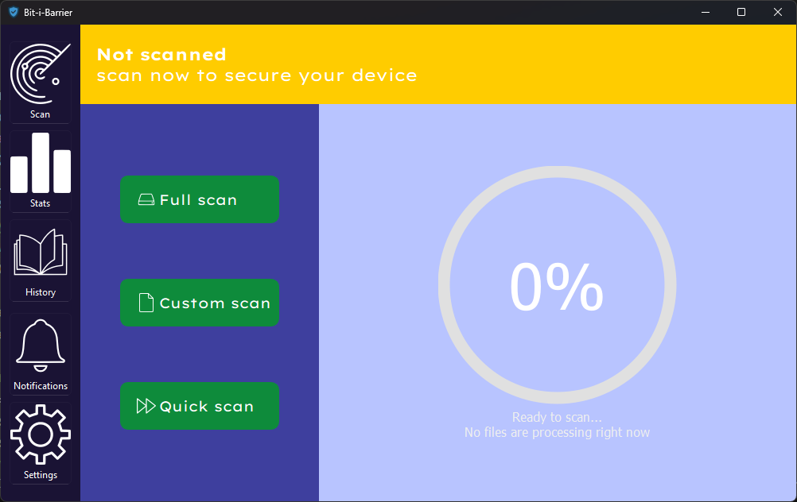

<h1 align="center">🦠 Bit‑i‑Barrier: AI Antivirus</h1>
<p align="center">
  
  
  
</p>
<p align="center">
  <b>Modern, AI-powered antivirus with a beautiful PyQt6 interface and real-time quarantine.</b>
</p>

---

## ✨ Features

- 🤖 <b>AI Malware Detection</b>  
  Trained models spot malicious files with high accuracy.
- 🖥️ <b>Modern PyQt6 GUI</b>  
  Sleek, responsive interface for scanning and management.
- ⚡ <b>Real-Time & Custom Scans</b>  
  Full, quick, and custom scan modes for flexibility.
- 📦 <b>Automatic Quarantine</b>  
  Instantly isolates threats to keep your system safe.
- 📊 <b>Threat History & Logs</b>  
  Review past scans and actions in a user-friendly log.
- 🛠️ <b>Configurable AI Models</b>  
  Easily switch between detection models in the settings.

---

## 🖼️ UI Preview

<p align="center">
  
</p>

---

## 🚀 Getting Started

### Prerequisites

- Python 3.9+
- PyQt6
- scikit-learn / TensorFlow (your ML backend)
- pandas, numpy
- pefile

### Installation

```bash
git clone https://github.com/yourusername/bit-i-barrier.git
cd bit-i-barrier
pip install -r requirements.txt
python -m package.ui
```

---

## 🧠 How It Works

1. **Scan**: Select a folder or run a quick/full scan.
2. **AI Analysis**: Files are analyzed by your chosen AI model.
3. **Quarantine**: Detected threats are automatically isolated.
4. **Review**: Manage quarantined files and review scan history.

---

## ⚙️ Project Structure

```
Qurantine_Virus/
├── package/
│   ├── ui.py           # Main PyQt6 GUI
│   ├── qurantine.py    # Scan logic & threading
│   ├── model_runner.py # AI model interface
│   ├── file_handler.py # Quarantine & logging
│   └── ...
├── Models/             # Trained AI models
├── Icons/              # App icons
├── requirements.txt
└── README.md
```

---

## 🙌 Credits

- Made by: [@BastianGDG](https://github.com/BastianGDG), [@06nicolaj](https://github.com/06nicolaj), [@RobinIsCoding](https://github.com/RobinIsCoding), and [@BertramAakjaer](https://github.com/BertramAakjaer)

---

<p align="center">
  <b>Stay safe. Stay smart. Stay ahead with Bit‑i‑Barrier.</b>
</p>